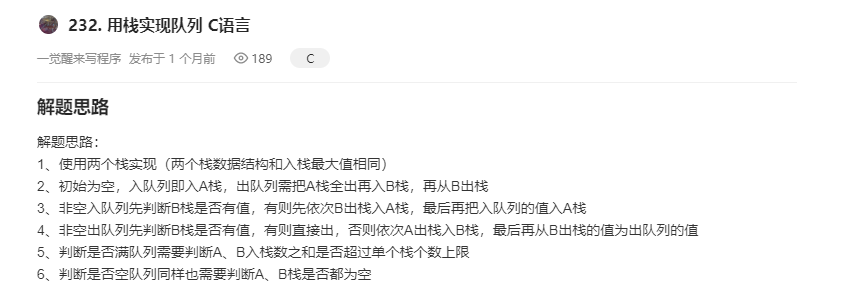

#### 0027 用栈实现队列

https://leetcode-cn.com/problems/implement-queue-using-stacks

**C**

以下是模板：

```c
typedef struct {

} MyQueue;

/** Initialize your data structure here. */

MyQueue* myQueueCreate() {

}

/** Push element x to the back of queue. */
void myQueuePush(MyQueue* obj, int x) {

}

/** Removes the element from in front of queue and returns that element. */
int myQueuePop(MyQueue* obj) {

}

/** Get the front element. */
int myQueuePeek(MyQueue* obj) {

}

/** Returns whether the queue is empty. */
bool myQueueEmpty(MyQueue* obj) {

}

void myQueueFree(MyQueue* obj) {

}

/**
 * Your MyQueue struct will be instantiated and called as such:
 * MyQueue* obj = myQueueCreate();
 * myQueuePush(obj, x);
 
 * int param_2 = myQueuePop(obj);
 
 * int param_3 = myQueuePeek(obj);
 
 * bool param_4 = myQueueEmpty(obj);
 
 * myQueueFree(obj);
*/
```

解法：



https://leetcode-cn.com/problems/implement-queue-using-stacks/solution/232-yong-zhan-shi-xian-dui-lie-cyu-yan-by-realjimm/

**注意：** 第三步逻辑有点问题。入队直接入A栈即可。（因为出队会先将B栈清空后才会再从A栈导入B栈）